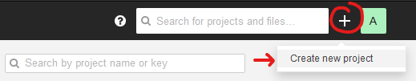
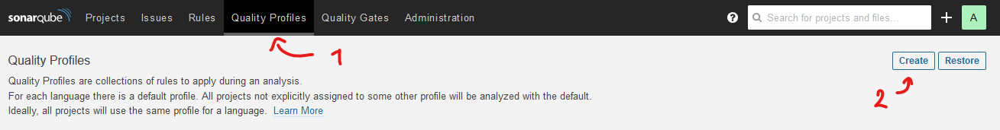
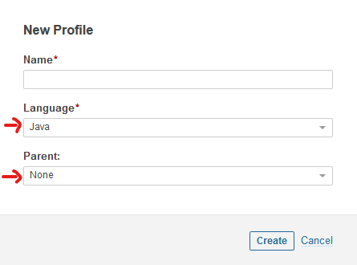
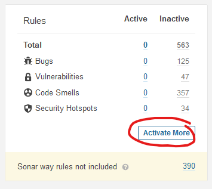
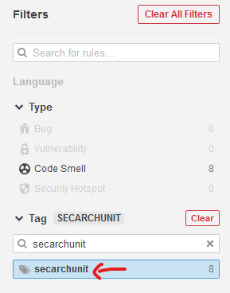
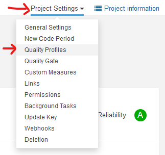
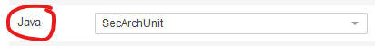

# SecArchUnit

Repository for the SecArchUnit master's thesis at Software Engineering.

The ArchUnit extension can be found in this separate repository: [SecArchUnit/ArchUnit](https://github.com/SecArchUnit/ArchUnit/tree/extension)

The thesis report (both the LaTeX workspace and the compiled PDF) is synced nightly in [the thesis branch](https://github.com/MarcusRandevik/SecArchUnit/tree/thesis).

## Prerequisites

* Java 11
* Maven (to build SecArchUnit)
* Gradle (to build our fork of ArchUnit)

## Using SecArchUnit

1. Open the relevant test project in your IDE
2. Run the SecurityTest class (constraints 1-5) as a JUnit test
3. Run the ExtensionTest class (constraints 6-7) as a JUnit test

## Using the SonarQube plugin

### Prerequisites

* SonarQube (tested on version 8.2.0.32929)
* sonar-scanner (tested on version 4.2.0.1873)

### Install SonarQube

1. [Download](https://www.sonarqube.org/downloads/) the latest version of SonarQube Community Edition
2. Extract it to a directory of your choice
3. Set the environment variable SONARQUBE_HOME to the location of the extracted directory
4. Find the directory for your OS under `$SONARQUBE_HOME/bin` and add it to your PATH
5. Start SonarQube by executing the command: `StartSonar` (Windows) or `sonar.sh` (Linux/MacOS)
6. Open SonarQube in your browser: http://localhost:9000
7. Log in with default credentials admin:admin

### Install sonar-scanner

1. [Download](https://docs.sonarqube.org/latest/analysis/scan/sonarscanner/) the latest version of SonarScanner
2. Extract it to a directory of your choice
3. Add `<extracted directory>/bin` to your PATH

### Validate constraints

1. Go to the directory of the relevant test project, e.g. `SecArchUnit/Validation/jpetstore`
2. Copy `sonarcustomrules-1.0-SNAPSHOT.jar` to `$SONARQUBE_HOME/extensions/plugins`
3. Restart SonarQube to load the plugin
4. Set up the project in SonarQube
   1. Open SonarQube in your browser: http://localhost:9000
   2. Create a new project
      
      * Set projectKey so that it matches the one in `sonar-project.properties` for your test project
   3. Create a new quality profile for the project  
        
      
   4. Activate the applicable rules under the **secarchunit** tag  
      
      
   5. Assign the newly created quality profile to the project  
      
      
5. Open a terminal in the project directory and run: `sonar-scanner`
6. See constraint violations in the SonarQube frontend

## Using the PMD plugin

### Prerequisites

* PMD (tested on version 6.23.0)

### Install PMD

1. [Download](https://pmd.github.io/) the latest version of PMD
2. Extract it to a directory of your choice
3. Set the environment variable PMD_HOME to the location of the extracted directory
4. Add the directory `$PMD_HOME/bin` to your PATH

### Validate constraints

1. Go to the directory of the relevant test project, e.g. `SecArchUnit/Validation/jpetstore`
2. Copy `pmd-custom-rules-1.0-SNAPSHOT.jar` to `$PMD_HOME/lib`
3. Extract annotations from the system: `./pmd-dump-annotations.sh`
   * This creates text files that describe the locations of all the `@UserInput` and `@InputValidation` annotations
4. Validate the constraints: `./pmd-test.sh`